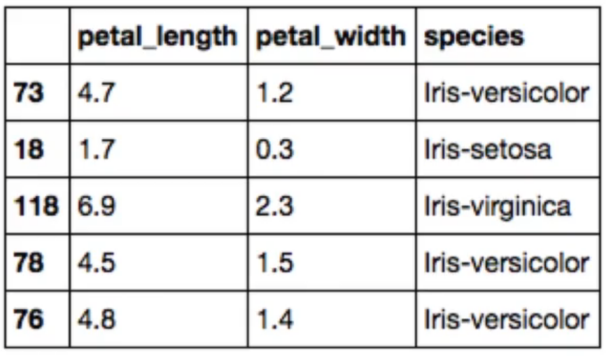
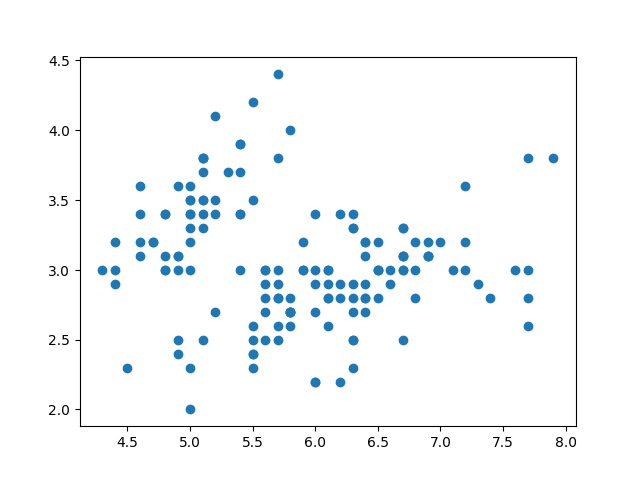
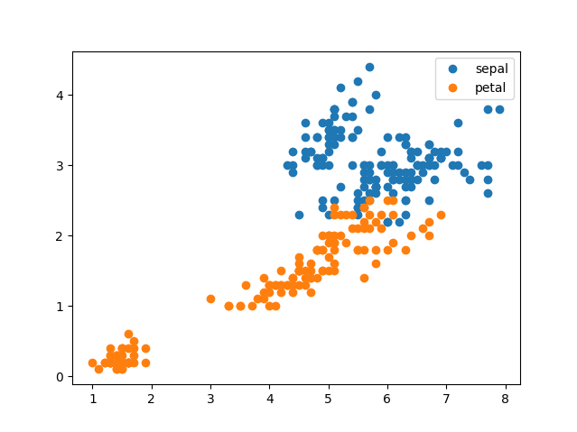
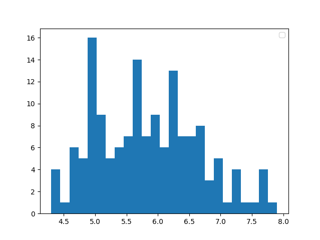
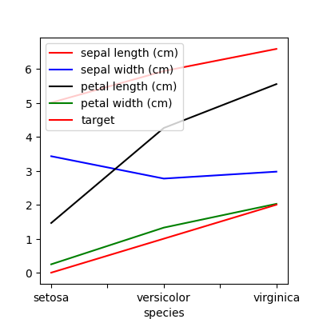
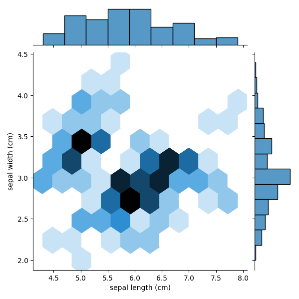
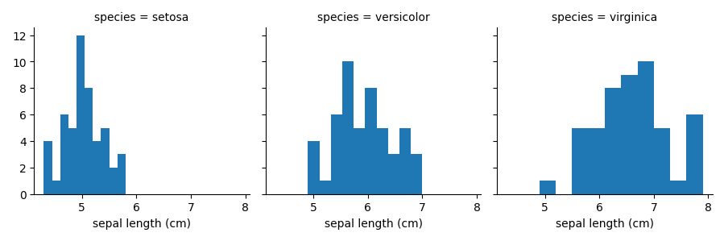

## Phần 1: Phân Tích Dữ Liệu Khám Phá (EDA)

### EDA là gì?
**Định nghĩa**: EDA là một phương pháp tiếp cận để phân tích các bộ dữ liệu nhằm tóm tắt những đặc điểm chính của chúng, thường thông qua các phương pháp trực quan và thống kê tóm lược.

**Mục đích**: Hãy xem EDA như "cuộc trò chuyện ban đầu" với dữ liệu – một giai đoạn "làm quen" với bộ dữ liệu của bạn.

### Tầm quan trọng của EDA
1.  **Đánh giá chất lượng dữ liệu**: Giúp xác định xem dữ liệu có hợp lý ở trạng thái hiện tại hay cần làm sạch thêm.
2.  **Nhận diện mẫu**: Hỗ trợ việc xác định các mẫu và xu hướng trong bộ dữ liệu.
3.  **Tạo ra insight**: Đôi khi, các mẫu được phát hiện trong quá trình EDA lại quan trọng ngang bằng (hoặc hơn) so với kết quả của mô hình cuối cùng.
4.  **Hiểu sâu về dữ liệu**: Giúp quyết định xem có cần thu thập thêm dữ liệu hay không.

### Các Kỹ Thuật EDA

#### Kỹ thuật thống kê tóm lược
*   **Giá trị trung bình (Mean)**: Thể hiện xu hướng trung tâm của dữ liệu.
*   **Trung vị (Median)**: Giá trị ở giữa, ít bị ảnh hưởng bởi các giá trị ngoại lai.
*   **Giá trị nhỏ nhất/lớn nhất (Min/Max)**: Các giới hạn của phạm vi dữ liệu.
*   **Yếu vị (Mode)**: Các giá trị xuất hiện thường xuyên nhất.
*   **Tương quan (Correlations)**: Mối quan hệ giữa các cột dữ liệu.

#### Kỹ thuật trực quan
*   **Biểu đồ tần suất (Histograms)**: Hiển thị sự phân phối của dữ liệu.
*   **Biểu đồ phân tán (Scatter plots)**: Cho thấy mối tương quan/quan hệ giữa hai cột.
*   **Biểu đồ hộp (Box plots)**: Trực quan hóa sự phân phối và xác định các giá trị ngoại lai.

### Ví dụ: Phân Tích Ứng Viên Xin Việc
**Ứng dụng thực tế của thống kê tóm lược:**

1.  **Điểm số trung bình**:
    *   Tính điểm phỏng vấn trung bình của tất cả ứng viên.
    *   Phân tích theo thành phố hoặc vị trí công việc.
    *   So sánh điểm cá nhân với điểm trung bình của nhóm.

2.  **Phân tích Yếu vị**:
    *   Tìm các từ phổ biến nhất trong hồ sơ ứng tuyển.
    *   Xác định các kỹ năng, bằng cấp thường xuyên xuất hiện.

3.  **Phân tích Tương quan**:
    *   Kiểm tra mối quan hệ giữa điểm đánh giá kỹ thuật và số năm kinh nghiệm.
    *   Phân tích sâu hơn theo loại kinh nghiệm để so sánh công bằng.
    *   Xác định các mối quan hệ ban đầu trước khi xây dựng mô hình.

### Lấy Mẫu từ DataFrame

**Tại sao cần lấy mẫu?**
1.  **Hiệu quả tính toán**: Các bộ dữ liệu lớn có thể mất quá nhiều thời gian để xử lý.
2.  **Phân chia tập Train/Test**: Dành ra một phần dữ liệu để kiểm thử mô hình.
3.  **Lấy mẫu đại diện**: Duy trì tỷ lệ của các biến kết quả.

#### Lấy mẫu phân tầng (Stratified Sampling)
**Khái niệm quan trọng**: Khi lấy mẫu, cần duy trì tỷ lệ tương tự như trong bộ dữ liệu gốc.

**Ví dụ**: Một bộ dữ liệu phát hiện bệnh trong đó chỉ 1% có bệnh.
*   Mẫu được lấy phải đảm bảo duy trì tỷ lệ 1% ca bệnh.
*   Tránh các mẫu có tỷ lệ 0% (thiếu trường hợp bệnh) hoặc bị đại diện quá mức.

#### Ví dụ Code: Lấy mẫu cơ bản
```python
# Giả sử 'data' là một DataFrame của pandas
sample = data.sample(n=5, replace=False)
# n=5: lấy 5 hàng ngẫu nhiên
# replace=False: mỗi hàng chỉ xuất hiện một lần (mặc định)

# Hiển thị 3 cột cuối của mẫu
print(sample.iloc[:, -3:])
# : có nghĩa là tất cả các hàng
# -3: có nghĩa là 3 cột cuối cùng```
**Kết quả**: 

**Ghi chú từ ví dụ**:
*   `.sample()` là một phương thức của pandas DataFrame.
*   `replace=False` ngăn chặn các hàng bị trùng lặp.
*   `.iloc[]` được sử dụng để lựa chọn dựa trên vị trí.

## Phần 2: Các Thư Viện Trực Quan Hóa Dữ Liệu

### Matplotlib
**Mục đích**: Là thư viện chính để tạo các biểu đồ và đồ thị trong Python.
*   **Ưu điểm**: Linh hoạt cao, có nhiều tính năng tùy chỉnh.
*   **Nền tảng**: Là cơ sở cho các thư viện trực quan hóa khác.

### Pandas Plotting
**Mục đích**: Một lớp bao (wrapper) tiện lợi được xây dựng trên Matplotlib.
*   **Ưu điểm**: Giúp vẽ biểu đồ nhanh chóng và dễ dàng.
*   **Hạn chế**: Ít linh hoạt hơn so với việc sử dụng Matplotlib trực tiếp.
*   **Trường hợp sử dụng**: Thường là "đủ tốt" cho các phân tích nhanh.

### Seaborn
**Mục đích**: Một thư viện vẽ biểu đồ thống kê được xây dựng dựa trên Matplotlib.
*   **Ưu điểm**:
    *   Tạo ra các biểu đồ có tính thẩm mỹ cao.
    *   Cung cấp các phương thức rút gọn cho các biểu đồ thống kê (mô hình tuyến tính, tương quan).
    *   Sẽ mất nhiều thời gian hơn nếu chỉ sử dụng Matplotlib.
*   **Lưu ý**: Một khi đã được import, các thiết lập của Seaborn cũng sẽ áp dụng cho các biểu đồ của Matplotlib.

### Cài đặt quan trọng cho Jupyter Notebooks
```python
import matplotlib.pyplot as plt
%matplotlib inline  # Bắt buộc để biểu đồ hiển thị trong notebook
```

## Phần 3: Tạo Các Trực Quan Hóa

### Biểu đồ phân tán cơ bản với Matplotlib
```python
import matplotlib.pyplot as plt

plt.plot(data['sepal_length'], data['sepal_width'], 
         ls='', marker='o')
# ls='': không có kiểu đường kẻ (để trống)
# marker='o': đánh dấu bằng dấu chấm tròn
# Các kiểu đánh dấu khác: '^' (tam giác), 'x' (dấu x)
```
**Kết quả**: 

**Lưu ý**:
*   Biểu đồ phân tán cho thấy mối quan hệ giữa hai biến.
*   Kiểu đường kẻ phải để trống để có một biểu đồ phân tán thực sự.
*   Kiểu đánh dấu ảnh hưởng đến sự rõ ràng của biểu đồ.

### Biểu đồ phân tán đa lớp
```python
# Vẽ dữ liệu của đài hoa (sepal)
plt.plot(data['sepal_length'], data['sepal_width'], 
         ls='', marker='o', label='sepal')

# Vẽ dữ liệu của cánh hoa (petal) trên cùng một đồ thị
plt.plot(data['petal_length'], data['petal_width'], 
         ls='', marker='o', label='petal')

plt.legend()  # Hiển thị chú thích với các nhãn
```
**Kết quả**: 

**Lưu ý**:
*   Nhiều lệnh gọi `plt.plot()` sẽ vẽ các lớp chồng lên nhau trên cùng một đồ thị.
*   Màu sắc được gán tự động.
*   Sử dụng `label` để kích hoạt chú thích (`legend`) nhằm làm rõ ý nghĩa.

### Biểu đồ tần suất (Histogram)
```python
plt.hist(data['sepal_length'], bins=25)
# bins: số lượng khoảng để nhóm dữ liệu
```
**Kết quả**: 

**Trường hợp sử dụng**: Giúp hiểu sự phân phối của một biến duy nhất.

### Tùy chỉnh nâng cao
```python
fig, ax = plt.subplots()  # Phương pháp tiếp cận hướng đối tượng

# Tạo biểu đồ cột ngang
ax.barh(np.arange(10), data['sepal_width'].iloc[:10])

# Tùy chỉnh các vạch chia (ticks)
ax.set_yticks(np.arange(0.4, 10.4, 1))  # Căn giữa các thanh
ax.set_yticklabels(range(1, 11))

# Thêm nhãn
ax.set(xlabel='Nhãn X', ylabel='Nhãn Y', title='Tiêu đề')
```
**Kết quả**: 

**Các khái niệm quan trọng**:
*   Cú pháp `fig, ax` cung cấp nhiều quyền kiểm soát hơn.
*   `fig`: đại diện cho toàn bộ cấu trúc biểu đồ.
*   `ax`: đại diện cho khu vực vẽ thực tế.
*   Thay thế `plt.` bằng `ax.` khi sử dụng phương pháp hướng đối tượng.

### Cú pháp Pandas Plotting
```python
# Nhóm theo loài và tính giá trị trung bình
grouped = data.groupby('species').mean()

# Tạo biểu đồ đường với các tùy chỉnh
grouped.plot(color=['red', 'blue', 'black', 'green'],
            fontsize=10,
            figsize=(4, 4))
```
**Kết quả**: 

**Ưu điểm**:
*   Vẽ biểu đồ trực tiếp từ DataFrame.
*   Tự động xử lý dữ liệu đã được nhóm.
*   Cú pháp ngắn gọn cho các thao tác phổ biến.

### Biểu đồ cặp của Seaborn (Pair Plot)
```python
import seaborn as sns

sns.pairplot(data, hue='species', height=3)
# hue: tô màu theo danh mục
# height: chiều cao của biểu đồ
```
**Kết quả**: 

**Biểu đồ này cho thấy gì**:
*   Biểu đồ phân tán giữa tất cả các cặp đặc trưng.
*   Biểu đồ tần suất trên đường chéo (vì không thể vẽ một biến với chính nó).
*   Các mối quan hệ được tô màu theo danh mục.

**Ứng dụng trong kinh doanh**: Có thể cho thấy mối quan hệ giữa chi tiêu quảng cáo và doanh thu, đồng thời xem xét sự phân phối của từng yếu tố.

### Biểu đồ lục giác của Seaborn (Hexbin Plot)
```python
sns.jointplot(x='sepal_length', y='sepal_width', 
              data=data, kind='hex')
```
**Kết quả**: 

**Các tính năng chính**:
*   Cho thấy mật độ của các điểm dữ liệu chồng chéo.
*   Các hình lục giác đậm màu hơn cho biết có nhiều điểm dữ liệu hơn.
*   Bao gồm các biểu đồ tần suất ở lề.
*   Tốt hơn biểu đồ phân tán khi dữ liệu có mật độ dày đặc.

### Lưới đa biểu đồ của Seaborn (Facet Grid)
```python
# Tạo một lưới với mỗi cột cho một loài
g = sns.FacetGrid(data, col='species', margin_titles=True)

# Áp dụng biểu đồ tần suất cho mỗi ô trong lưới
g.map(plt.hist, 'sepal_width')

# Tạo một lưới thứ hai cho một biến khác
g2 = sns.FacetGrid(data, col='species')
g2.map(plt.hist, 'sepal_length')
```

**Lợi ích**:
*   So sánh sự phân phối giữa các danh mục.
*   Sử dụng cùng một thang đo để dễ dàng so sánh.
*   Tương tự như `groupby` nhưng ở dạng trực quan.

## Phần 4: Feature Engineering & Biến Đổi Biến

Feature engineering là quá trình tạo, biến đổi hoặc lựa chọn các đặc trưng (biến đầu vào) từ dữ liệu thô để cải thiện hiệu suất của một mô hình học máy.

### Khái niệm cốt lõi
Các mô hình thường đưa ra các giả định về dữ liệu. Chúng ta biến đổi dữ liệu thô để:
1.  Đáp ứng các giả định của mô hình.
2.  Tối ưu hóa hiệu suất của mô hình.
3.  Tạo ra các mối quan hệ tuyến tính khi cần thiết.

### Nền tảng Hồi quy tuyến tính
**Mô hình tuyến tính cơ bản**:
```
y = β₀ + β₁×x₁ + β₂×x₂
```

**Thành phần**:
*   y: biến mục tiêu/kết quả
*   x₁, x₂: các biến đặc trưng/dự đoán
*   β₀: hệ số chặn (intercept)
*   β₁, β₂: các hệ số (coefficients)

**Ví dụ thực tế**: Doanh thu phòng vé
*   x₁ = ngân sách cho diễn viên
*   x₂ = ngân sách cho marketing
*   β₁, β₂ = mức độ ảnh hưởng của mỗi loại ngân sách đến doanh thu

### Tại sao cần biến đổi biến?

#### Vấn đề: Dữ liệu bị lệch (Skewed Data)
*   Dữ liệu thô thường bị lệch âm hoặc lệch dương.
*   Hồi quy tuyến tính giả định rằng phần dư (residuals) có phân phối chuẩn.
*   Các phép biến đổi giúp đạt được phân phối chuẩn.

#### Giải pháp: Các phép biến đổi dữ liệu

**Biến đổi Logarit**:
```python
from numpy import log, log1p
# log1p cộng 1 trước khi lấy log (để xử lý các giá trị bằng không)
transformed = log1p(data['column'])
```

**Khi nào nên dùng biến đổi Logarit**:
*   Dữ liệu bị lệch dương.
*   Các mối quan hệ có lợi nhuận giảm dần.
*   Ví dụ: Ngân sách phim lớn hơn có lợi nhuận giảm dần đối với doanh thu phòng vé.

**Kết quả**: Biến đổi một phân phối lệch → phân phối chuẩn.

### Đặc trưng đa thức (Polynomial Features)
**Mục đích**: Nắm bắt các mối quan hệ phi tuyến tính trong khi vẫn giữ được mô hình tuyến tính.

```python
from sklearn.preprocessing import PolynomialFeatures

# Tạo đối tượng biến đổi
polyFeat = PolynomialFeatures(degree=2)

# Khớp với dữ liệu
polyFeat.fit(X_data)

# Biến đổi dữ liệu (x trở thành x và x²)
X_poly = polyFeat.transform(X_data)
```

**Lưu ý**: Đây vẫn là một mô hình tuyến tính, chỉ là các đặc trưng đã được biến đổi (x, x², x³).

## Phần 5: Lựa chọn & Mã hóa Biến

### Các loại biến

#### Số liên tục (Continuous Numerical)
*   Các giá trị số thô.
*   Cần được co giãn (scaling) để so sánh.

#### Danh nghĩa (Nominal - Categorical, Unordered)
*   Các danh mục không có thứ tự tự nhiên.
*   Ví dụ: đỏ/xanh/lục, đã kết hôn/độc thân.
*   Cần được mã hóa thành số.

#### Thứ tự (Ordinal - Categorical, Ordered)
*   Các danh mục có thứ tự ý nghĩa.
*   Ví dụ: thấp/trung bình/cao, lạnh/ấm/nóng.
*   Thứ tự rất quan trọng khi mã hóa.

### Các kỹ thuật mã hóa

#### Mã hóa nhị phân (Binary Encoding)
*   Dành cho các biến có hai giá trị.
*   Chuyển đổi thành 0 và 1.
*   Ví dụ: đúng/sai, nam/nữ, đã kết hôn/chưa kết hôn.

#### Mã hóa One-Hot (One-Hot Encoding)
**Quy trình**:
1.  Tạo một cột mới cho mỗi danh mục.
2.  Đánh dấu 1 nếu danh mục đó có mặt, 0 nếu không.

**Ví dụ**: Cột màu sắc (đỏ, xanh, lục) sẽ trở thành:
*   is_red:
*   is_blue:
*   is_green:

**Các lựa chọn về code**:
```python
from sklearn.preprocessing import OneHotEncoder, LabelBinarizer
# hoặc
pd.get_dummies(data['column'])  # Phương thức của Pandas
```

#### Mã hóa thứ tự (Ordinal Encoding)
*   Chuyển đổi các danh mục có thứ tự thành số nguyên.
*   Ví dụ: thấp→1, trung bình→2, cao→3.

**Lưu ý**: Giả định rằng khoảng cách giữa các danh mục là bằng nhau (điều này có thể không đúng).

**Các lựa chọn về code**:
```python
from sklearn.preprocessing import OrdinalEncoder, DictVectorizer
```

## Phần 6: Co giãn Đặc trưng (Feature Scaling)

### Tại sao cần co giãn đặc trưng?
**Vấn đề**: Các đặc trưng thường có thang đo rất khác nhau.
*   Giá: từ 0 đến 10
*   Số lượng cửa hàng: từ 10.000 đến 50.000

**Ví dụ về tác động: Thuật toán K-Nearest Neighbors**
Hãy tưởng tượng tuổi được đo bằng giây so với năm:
*   Chênh lệch tuổi (20→21 tuổi) = 31,5 triệu giây.
*   Chênh lệch số ca phẫu thuật (1→10) = 9 đơn vị.
*   Thuật toán sẽ chỉ nhóm theo tuổi, bỏ qua số ca phẫu thuật!

### Các phương pháp co giãn

#### Co giãn tiêu chuẩn (Standard Scaling - Z-score)
**Công thức**: (giá trị - trung bình) / độ lệch chuẩn

**Đặc điểm**:
*   Tạo ra các đơn vị được chuẩn hóa.
*   Tập trung dữ liệu quanh giá trị 0.
*   Bị ảnh hưởng bởi các giá trị ngoại lai (nhưng ít hơn min-max).

```python
from sklearn.preprocessing import StandardScaler
```

#### Co giãn Min-Max (Min-Max Scaling)
**Công thức**: (giá trị - min) / (max - min)

**Đặc điểm**:
*   Co giãn tất cả các giá trị về khoảng.
*   Bị ảnh hưởng nặng nề bởi các giá trị ngoại lai.
*   Hữu ích khi bạn cần một phạm vi bị giới hạn.

```python
from sklearn.preprocessing import MinMaxScaler
```

**Ví dụ tính toán**:
*   Min=3, Max=100, Giá trị=40
*   Giá trị đã co giãn = (40-3)/(100-3) = 37/97 ≈ 0.38

#### Co giãn Mạnh mẽ (Robust Scaling)
**Phương pháp**: Sử dụng khoảng tứ phân vị (interquartile range) thay vì min/max.

**Đặc điểm**:
*   Mạnh mẽ trước các giá trị ngoại lai.
*   Không đảm bảo phạm vi.
*   Tốt hơn cho dữ liệu bị lệch.

```python
from sklearn.preprocessing import RobustScaler
```

## Tóm tắt: Hướng dẫn biến đổi theo loại đặc trưng

### Giá trị số liên tục
*   **Phép biến đổi**: Standard, Min-Max, hoặc Robust Scaling.
*   **Lựa chọn dựa trên**: Sự hiện diện của giá trị ngoại lai, nhu cầu về một phạm vi bị giới hạn.

### Danh nghĩa/Phân loại (Không có thứ tự)
*   **Biến nhị phân**: Mã hóa nhị phân (0/1).
*   **Nhiều danh mục**: Mã hóa One-hot.
*   **Các hàm chính**: `LabelEncoder`, `LabelBinarizer`, `OneHotEncoder`, `pd.get_dummies()`.

### Thứ tự (Phân loại có thứ tự)
*   **Phương pháp**: Mã hóa số nguyên (1, 2, 3...).
*   **Đánh đổi**: Giữ lại thứ tự nhưng giả định khoảng cách bằng nhau.
*   **Lựa chọn thay thế**: Mã hóa One-hot (làm mất thông tin về thứ tự).
*   **Các hàm chính**: `DictVectorizer`, `OrdinalEncoder`.

## Những điểm chính cần nhớ

1.  **EDA là thiết yếu**: Luôn khám phá dữ liệu trước khi xây dựng mô hình – đó là cuộc trò chuyện của bạn với dữ liệu.

2.  **Trực quan hóa giúp hé lộ các mẫu**: Các loại biểu đồ khác nhau phục vụ các mục đích khác nhau:
    *   **Phân tán**: Các mối quan hệ.
    *   **Tần suất**: Các phân phối.
    *   **Hộp**: Các giá trị ngoại lai.
    *   **Cặp**: Tất cả các mối quan hệ cùng một lúc.

3.  **Feature Engineering tạo ra các mô hình tốt hơn**:
    *   Biến đổi để đáp ứng các giả định của mô hình.
    *   Tạo mối quan hệ tuyến tính thông qua biến đổi log/đa thức.
    *   Tất cả các đặc trưng phải ở dạng số để mô hình có thể xử lý.

4.  **Co giãn ngăn ngừa sự thiên vị**: Các đặc trưng trên các thang đo khác nhau có thể chi phối các thuật toán dựa trên khoảng cách.

5.  **Lựa chọn phương pháp mã hóa một cách khôn ngoan**:
    *   Bảo toàn thông tin (như thứ tự) khi có liên quan.
    *   Tạo ra các biểu diễn số phù hợp.
    *   Xem xét các giả định của thuật toán.

6.  **Các thư viện phối hợp với nhau**:
    *   **pandas**: Thao tác dữ liệu.
    *   **matplotlib**: Vẽ biểu đồ linh hoạt.
    *   **seaborn**: Trực quan hóa thống kê.
    *   **sklearn**: Các phép biến đổi và co giãn.