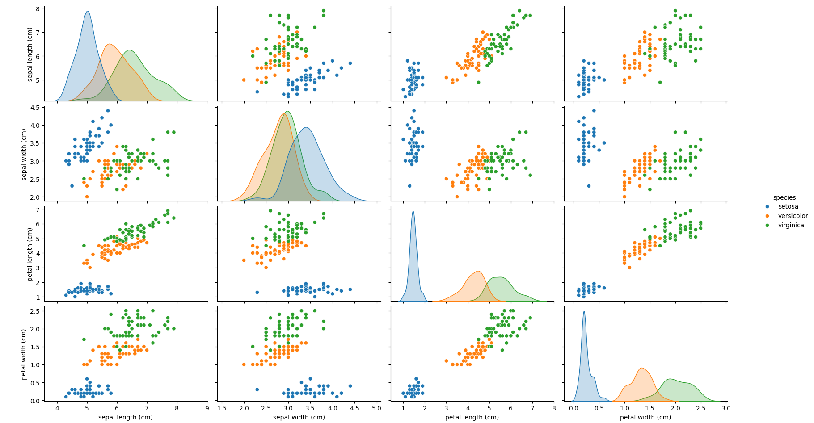
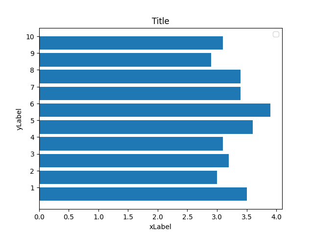
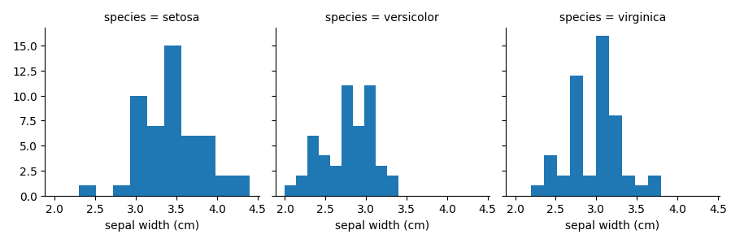

# Module 3: Quy Trình Xử Lý Dữ Liệu 3 Bước Tinh Gọn

Mục tiêu của module này là cung cấp một quy trình làm việc hiệu quả, giúp bạn đi từ dữ liệu thô đến dữ liệu sẵn sàng cho mô hình chỉ trong 3 bước rõ ràng.

---

## Bước 1: Nhận Diện Toàn Cảnh (Cái nhìn 360 độ)

**Mục tiêu:** Nhanh chóng nắm bắt toàn bộ "bức tranh" của dữ liệu. Thay vì xem xét từng cột riêng lẻ, chúng ta sẽ xem xét tất cả các mối quan hệ và phân phối cùng một lúc.

**Công cụ chính:** `seaborn.pairplot`. Đây là công cụ mạnh mẽ nhất cho bước này.
*   Nó vẽ biểu đồ phân tán cho **mọi cặp biến** để bạn thấy các mối tương quan.
*   Nó vẽ biểu đồ tần suất cho **từng biến** để bạn thấy sự phân phối.

```python
import seaborn as sns

# Vẽ biểu đồ tổng quan cho toàn bộ dữ liệu, tô màu theo 'species'
sns.pairplot(data, hue='species', height=3)
```
**Kết quả**: 

➡️ **Hành động:** Quan sát biểu đồ này. Tìm kiếm những mối quan hệ nổi bật hoặc những điểm bất thường. Ghi chú lại những cặp biến có vẻ liên quan chặt chẽ nhất để điều tra ở bước tiếp theo.

---

## Bước 2: Phân Tích Chuyên Sâu (Phóng to vào điểm đáng chú ý)

**Mục tiêu:** Sau khi đã xác định một điểm thú vị từ cái nhìn toàn cảnh ở Bước 1 (ví dụ: một mối quan hệ mạnh mẽ, một cụm dữ liệu lạ), bây giờ là lúc "phóng to" vào đó. Chúng ta sẽ tạo một biểu đồ chi tiết, rõ ràng và có chú thích đầy đủ.

**Công cụ chính:** `matplotlib` với cú pháp hướng đối tượng (`fig, ax`). Cách này cho bạn toàn quyền kiểm soát để tùy chỉnh biểu đồ một cách chuyên nghiệp.

```python
# Cú pháp fig, ax cho phép tùy chỉnh sâu
fig, ax = plt.subplots()

# Vẽ và tùy chỉnh một biểu đồ cụ thể để làm rõ một điểm
ax.barh(np.arange(10), data['sepal_width'].iloc[:10])
ax.set(xlabel='Chiều rộng đài hoa', ylabel='ID Mẫu dữ liệu', title='Phân Tích Chi Tiết Chiều Rộng Đài Hoa')
```
**Kết quả**: 

➡️ **Hành động:** Sử dụng kỹ thuật này để tạo ra các biểu đồ "chất lượng cao" nhằm chứng minh một luận điểm hoặc trực quan hóa một khía cạnh cụ thể mà bạn đã phát hiện ở Bước 1.

---

## Bước 3: Chuẩn Bị Dữ Liệu (Sẵn sàng cho mô hình)

**Mục tiêu:** Biến đổi dữ liệu thô thành định dạng số, đồng nhất mà các mô hình máy học có thể hoạt động hiệu quả.

### **Quy tắc vàng:**

*   **Dữ liệu dạng chữ (Categorical):**
    *   Nếu không có thứ tự (VD: "Hà Nội", "TP.HCM") → Dùng `pd.get_dummies()` để tạo các cột 0/1.
    *   Nếu có thứ tự (VD: "Kém", "Tốt") → Chuyển thành số nguyên (VD: 0, 1).

*   **Dữ liệu dạng số (Numerical):**
    *   Nếu các cột có thang đo quá khác nhau (VD: tuổi và thu nhập) → **BẮT BUỘC** phải co giãn (scale). `StandardScaler` là lựa chọn phổ biến và an toàn nhất.
    *   Nếu dữ liệu bị lệch → Cân nhắc dùng phép biến đổi logarit `np.log1p()`.

### **Kiểm tra cuối cùng:**

Sau khi biến đổi, hãy kiểm tra lại xem phân phối của dữ liệu có hợp lý không, đặc biệt là khi so sánh giữa các nhóm khác nhau. `FacetGrid` của Seaborn là công cụ hoàn hảo để làm việc này.

```python
# Tạo lưới biểu đồ để so sánh phân phối của 'sepal_width' trên mỗi 'species'
g = sns.FacetGrid(data, col='species')
g.map(plt.hist, 'sepal_width')
```


➡️ **Hành động:** Áp dụng các quy tắc trên để làm sạch và chuẩn hóa dữ liệu. Luôn kiểm tra lại kết quả bằng trực quan hóa để đảm bảo các phép biến đổi của bạn không làm mất đi những đặc tính quan trọng của dữ liệu.